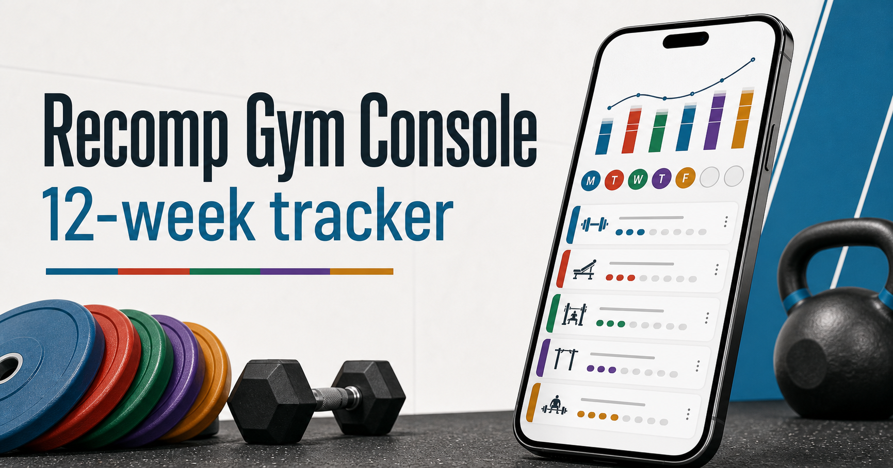
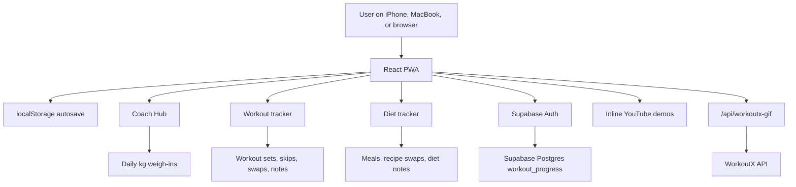

<div align="center">

# Workout Tracker

### A mobile-first coaching app for workouts, nutrition, weigh-ins, and progress.

[](https://react.dev/)
[](https://www.typescriptlang.org/)
[](https://vite.dev/)
[](https://supabase.com/)
[](https://vercel.com/)

**Workout Tracker** turns a complete body recomposition routine into a clean, phone-friendly Progressive Web App. It helps a user follow a 26-week training program, track every set, log daily nutrition, record morning body weight in kg, and sync progress across devices.

[Live app](https://ali-workout.vercel.app) - [Features](#features) - [Run locally](#quick-start) - [Deploy](#deploy-to-vercel) - [Supabase sync](#supabase-cloud-sync)



</div>

---

## Table of Contents

- [What This App Is](#what-this-app-is)
- [Product Philosophy](#product-philosophy)
- [Features](#features)
- [App Sections](#app-sections)
- [How The Program Works](#how-the-program-works)
- [Knee And Hip Friendly Lower Body](#knee-and-hip-friendly-lower-body)
- [Tech Stack](#tech-stack)
- [Architecture](#architecture)
- [Code Comments And Walkthrough](#code-comments-and-walkthrough)
- [Quick Start](#quick-start)
- [Environment Variables](#environment-variables)
- [Supabase Cloud Sync](#supabase-cloud-sync)
- [WorkoutX GIF Setup](#workoutx-gif-setup)
- [Install On iPhone](#install-on-iphone)
- [After-Work Training Fuel](#after-work-training-fuel)
- [Deploy To Vercel](#deploy-to-vercel)
- [GitHub Workflow](#github-workflow)
- [Useful Commands](#useful-commands)
- [Project Structure](#project-structure)
- [Customization Guide](#customization-guide)
- [Quality And Testing](#quality-and-testing)
- [Troubleshooting](#troubleshooting)
- [Safety Note](#safety-note)
- [Credits And References](#credits-and-references)

---

## What This App Is

Workout Tracker is a personal coaching dashboard for someone who wants a structured fitness routine without carrying a spreadsheet, notes app, printed plan, or messy document into the gym.

The app ships with:

- A 26-week progressive workout program.
- A built-in fat-loss diet plan with daily recipes.
- A Coach Hub for sign-in, morning weigh-ins, and weight trend review.
- A Gym Mode that shows the current exercise, current set, target, video, GIF option, and completion controls.
- Cloud sync through Supabase so the same account can be used on iPhone, MacBook, and any other device.

> [!NOTE]
> The original training and nutrition ideas were converted into app data. A new user does not need any external file to understand or use the project. The program, meals, recipes, cues, videos, swaps, and progression rules are already inside the app.

---

## Product Philosophy

This project is designed around one simple idea:

> The best plan is the one you can actually follow when you are tired, busy, and standing in the gym.

That means the interface favors:

- **Clarity:** every day has a clear order.
- **Progression:** the plan gets harder over time instead of repeating the same week forever.
- **Visibility:** workouts, meal slots, day types, and completion states are color-coded.
- **Honesty:** skipped movements are tracked separately from completed days.
- **Low friction:** progress saves automatically.
- **Mobile-first use:** the app works as an iPhone Home Screen app and as a desktop web app.

---

## Features

### Core Experience

| Area | What It Does |
| --- | --- |
| Coach Hub | Home base for sign-in, morning weight, weekly weight averages, and quick access to Workout or Diet. |
| Workout | Full workout tracker with Today, Week, Gym Mode, Progress, and Library sections. |
| Diet | Daily meals with recipe photos, meal swaps, timing labels, plate portions, and a weekly to-buy list. |
| Cloud Sync | Saves the same progress to Supabase for use across multiple devices. |
| PWA | Can be installed on iPhone Home Screen and used like an app. |

### Workout Features

| Feature | Details |
| --- | --- |
| 26-week calendar | Program starts from a configurable start date and runs for 182 days. |
| Smart Today behavior | Workout and Diet open to the current program week and day. |
| Gym Mode | Always shows the actual current day and starts on the first unfinished movement. |
| Ordered move list | Warm-ups, ramp sets, lifting, accessories, cardio, and core are shown in the correct order. |
| Set logging | Strength sets track weight in pounds/lbs and completion. |
| Done-only moves | Warm-ups, cardio, and bodyweight targets do not show fake weight inputs. |
| Exercise detail sheet | Includes cues, mistakes, progression notes, resources, inline YouTube, GIF option, swaps, and set log. |
| Knee/hip-friendly lower body | Default lower-body work avoids forced deep squats and uses supported leg press ranges, quad/hamstring machines, glute bridges, and hip-control warm-ups. |
| Beginner-to-trained progression | Month 1 teaches the gym, then each 4-week block earns more volume, stronger loading, longer cardio, and more confident execution. |
| Earned training week | Targets advance with the calendar only when enough strength sessions have been completed, so missed weeks do not automatically create harder workouts. |
| RIR and set feel | Gym Mode explains Reps In Reserve and lets each set be marked Too easy, About right, or Very hard for smarter load suggestions. |
| Readiness check | Energy, soreness, joint pain, and sleep create Green, Yellow, or Red training guidance before each workout. |
| Rest timer | Completing a set starts a movement-specific rest timer with longer rest for main lifts and shorter rest for core/accessories. |
| Monthly check-ins | Every 4 weeks, the app reviews strength, cardio, weight trend, waist checkpoint, optional photos, and recovery feedback. |
| Skip tracking | Supports Time, Pain, Equipment, Fatigue, and Other skip reasons. |
| Day status | Separates Complete, Finished with skips, and Incomplete days. |
| Home/gym labels | Marks exercises as Upstairs OK, Downstairs, Downstairs/outside, or Either. |
| Exercise library | Searchable movement library with demos and coaching notes. |

### Diet Features

| Feature | Details |
| --- | --- |
| Daily meal plan | Breakfast, Lunch, Snack, and Dinner for every program day. |
| Color-coded meals | Breakfast, lunch, snack, and dinner each have their own visual identity. |
| Day type targets | Strength, Cardio, and Recovery days use different calorie and macro targets. |
| Recipe photos | Each meal has a visual recipe card. |
| Expandable Make It guide | Meal cards stay clean, but the Make It button opens actual step-by-step instructions for that exact food. |
| Plate portions | Shows what to actually put on the plate after cooking. |
| Timing labels | Uses practical labels like Morning, Midday, Before workout, and After workout. |
| After-work gym fuel | Strength days explain what to eat 60-120 minutes before a typical 5pm+ workout. |
| Meal swaps | Swap within the same meal category for variety while keeping the plan aligned. Swapped meals are clearly labeled and include a visible Revert to original button. |
| Preference-aware defaults | Beans, chickpeas, turkey, rice cakes, and muesli stay available as swaps but are not default meals. |
| To-buy list | Builds a store-neutral ingredient list from the selected week and active swaps. |
| Completion tracking | Each meal can be marked eaten; full days show clearly when complete. |

### Progress Features

| Feature | Details |
| --- | --- |
| Morning weight in kg | Daily weigh-ins live in Coach Hub. |
| Weekly averages | Compares week-to-week averages once there is enough data. |
| Weight trend chart | Shows the latest logged weights as a visual line chart with high, low, and window change. |
| Expandable history | Recent daily weight inputs and weekly average history are tucked behind expandable panels to avoid a 182-day wall of data. |
| Missing data awareness | If some mornings are not logged, the app calculates from logged days and tells the user. |
| Workout achievements | Tracks consistency, completed sets, cardio minutes, strength days, skipped work, and best logged loads. |
| Automatic saving | Saves locally first, then syncs to Supabase when signed in. |

---

## App Sections

### Coach Hub

Coach Hub is the landing page. It keeps general account and body-weight tracking separate from the workout and diet pages.

Use Coach Hub to:

- Sign in or create an account.
- Check sync status.
- Log morning body weight in kg.
- Review the weight trend chart.
- Expand recent daily weight entries only when editing older mornings.
- Compare weekly weight averages.
- Enter Workout or Diet mode.

### Workout

The Workout section is the training command center.

It includes:

- **Today:** the full ordered plan for the selected date.
- **Week:** a compact weekly planner.
- **Gym Mode:** a focused set-by-set view for the actual current day.
- **Progress:** training stats, completion history, streaks, best loads, and achievements.
- **Library:** all exercises, resources, videos, GIF controls, and swaps.

### Diet

The Diet section is a simple daily food tracker.

It includes:

- Four meals per day.
- Recipe photos.
- Exact plate portions.
- Expandable recipe-specific cooking instructions behind each Make It button.
- Macro targets.
- Meal timing chips.
- After-work pre-workout fueling guidance.
- Same-category swaps.
- Weekly to-buy list.
- A notes field for hunger, digestion, swaps, or meal prep reminders.

---

## How The Program Works

The program is built for a true beginner who wants to train seriously for six months. The first month is deliberately smaller so the user can learn machines, setup, breathing, bracing, pain-free range of motion, logging, and recovery. After that, the app adds work gradually.

The weekly structure stays consistent:

| Day | Focus |
| --- | --- |
| Monday | Strength A |
| Tuesday | Cardio Base |
| Wednesday | Strength B |
| Thursday | Easy Movement |
| Friday | Strength C |
| Saturday | Long Cardio |
| Sunday | Recovery |

### Six-Month Training Blocks

| Block | Goal | Strength Work | Cardio | Time Target |
| --- | --- | --- | --- | --- |
| Weeks 1-4: Foundation | Learn how to train and recover. | 5-6 meaningful exercises, mostly 2 working sets, 3-4 RIR. | Tue 20-30 min, Sat 35-45 min, optional finishers 5-10 min. | 45-60 min |
| Weeks 5-8: Build | Increase training capacity. | Main lifts can move to 3 sets, accessories stay mostly 2, 2-3 RIR. | Tue 25-35 min, Sat 40-50 min. | 50-65 min |
| Weeks 9-12: Progress | Start looking and performing like someone who trains. | Main lifts 3 sets, direct arms, progressive core, 2-3 RIR. | Tue 30-40 min, Sat 45-55 min. | 55-70 min |
| Weeks 13-16: Build Again | Add useful volume without making workouts huge. | Main lifts 3 sets, one main lift may use 4 if recovery is good. | Tue 35-45 min, Sat 50-60 min. | 60-75 min |
| Weeks 17-20: Stronger Training | Push performance with quality reps. | Most major lifts stay 3 sets, one or two may use 4, 1-3 RIR. | Tue 40-45 min, Sat 55-65 min. | 65-80 min |
| Weeks 21-24: Consolidate And Perform | Use the fitness already built. | Hold volume, improve weight, reps, control, and range. | Tue 40-50 min, Sat 60-75 min if recovery is good. | 65-85 min |
| Weeks 25-26: Final Comparison | Compare results without max testing. | Normal clean training plus progress review. | Compare duration, pace, and consistency. | 60-75 min |

### Earned Progression

The app separates **calendar week** from **training week**. If the calendar says Week 4 but the user missed too many strength sessions, the targets can stay closer to Week 2 until more sessions are completed.

That matters for a beginner because adaptation is earned by repeated practice, not by time passing on a calendar. The app uses strength-session completion, monthly recovery feedback, and readiness to decide whether today should progress normally, hold steady, or reduce volume.

### Month 1 Strength Sessions

Month 1 is intentionally less crowded:

| Session | Main Flow |
| --- | --- |
| Strength A | Leg Press, Incline Dumbbell Press, Lat Pulldown, Dumbbell Romanian Deadlift, Front Plank, optional short treadmill finish. |
| Strength B | Leg Press, Single-Arm Dumbbell Row, Glute Bridge, Push-Up or incline variation, Seated Dumbbell Overhead Press, Dead Bug. |
| Strength C | Leg Press, Incline Dumbbell Press, Lat Pulldown, Romanian Deadlift, Seated Leg Curl, Plank or Dead Bug. |

Later blocks gradually introduce leg extensions, additional hamstring work, cable fly, reverse fly, biceps curls, triceps pressdowns, and a progressively loadable core movement such as cable crunch.

### Effort, Rest, And Load Progression

The app uses **RIR**, or Reps In Reserve, to explain how hard each set should feel:

| RIR | Meaning |
| --- | --- |
| 4 RIR | About 4 clean reps left. |
| 3 RIR | About 3 clean reps left. |
| 2 RIR | About 2 clean reps left. |
| 1 RIR | Maybe 1 clean rep left. |
| 0 RIR | No more reps possible. This plan does not require failure. |

Gym Mode asks how each set felt: **Too easy**, **About right**, or **Very hard**. The app uses that with double progression. For an 8-12 rep target, the user keeps the same pounds until all sets reach the top of the range with clean form, then the app suggests the smallest available weight increase.

Rest timers start automatically when a set is completed:

| Movement Type | Rest |
| --- | --- |
| Main lifts | 90-120 seconds |
| Normal compounds | 75-90 seconds |
| Accessories | 60-75 seconds |
| Core | 45-60 seconds |
| Ramp warm-ups | 45-60 seconds |

The goal is not to shorten useful rest. If workouts become too long, the app trims optional work instead of rushing important sets.

### Monthly Check-Ins

Every 4 weeks, the app opens a coach-style review:

- Strength sessions completed.
- Cardio days completed.
- Weekly average body weight.
- Waist checkpoint.
- Optional progress-photo reminder with same-lighting guidance.
- Leg press, press, pulldown/row, and RDL comparison.
- Recovery feedback: Easy, About right, or Very hard.

The app defines six-month success broadly: consistency, stronger lifts, better walking fitness, better skill, healthier nutrition habits, waist and/or weight trend moving toward the goal, and more visible muscle definition. Visible abs may happen for some users, but the app does not guarantee them because body-fat level, genetics, sex, fat distribution, and adherence all matter.

### Nutrition

Nutrition uses calorie cycling by day type, but targets are configurable because different bodies need different amounts:

| Day Type | Target |
| --- | --- |
| Strength day | Higher-carb training day to support lifting performance. |
| Cardio day | Moderate-carb day for walking volume and recovery. |
| Recovery day | Slightly lower-starch day while keeping protein high. |

Coach Hub lets the user choose a calorie mode, while protein is calculated automatically from existing weigh-ins. Once the user has at least three recent morning logs, the app uses the recent average body weight; before that, it uses the latest logged weight. If no weight has been logged yet, it shows the general `1.6-2.0 g/kg` protein range instead of asking for another confusing input.

The default grocery pattern favors easy repeat purchases: Greek yogurt, cottage cheese, eggs, egg whites, chicken breast or skinless chicken thighs, lean beef, tuna, salmon, white fish, oats, rice, quinoa, potatoes, fruit, and vegetables. The main week now includes lean beef with pasta, lean beef with rice, and lean beef with potatoes, while still keeping fish and chicken in rotation for variety. Beans, chickpeas, turkey, rice cakes, muesli, tofu, and egg-only bowls remain in the recipe library as optional swap choices, but they are no longer default meals.

Each recipe has a compact card for quick gym-day scanning and an expandable Make It guide for cooking. The guide skips repeated generic setup text and explains the actual food steps for that recipe, such as mixing a yogurt bowl, toasting a pre-workout snack, warming chicken and grains, cooking eggs, or plating fish with potatoes and vegetables.

Lean beef meals are portioned around extra-lean beef, measured rice or potatoes, and a large vegetable serving. Oils, marinara, salsa, and avocado-style add-ons are marked optional where skipping or measuring them better supports fat loss.

Coach Hub keeps weight tracking compact. The main view shows weekly averages, a recent weight trend graph, a motivating coach note, and only expands the daily log when the user wants to edit recent mornings. Weekly history shows the latest weeks first so the dashboard stays useful across the full 182-day program.

For users who train after work, strength-day snacks are treated as the pre-workout fuel window. The app recommends eating the planned snack about 60-120 minutes before lifting and keeping lunch complete earlier in the day so the gym session does not start under-fueled.

Workout and diet swaps are intentionally loud. When a movement or meal is using a swap, the app marks it as a Swap version, shows the original plan item, and gives a Revert to original button so the user never mistakes a replacement for the main plan.

---

## Knee And Hip Friendly Lower Body

The lower-body plan is designed for a user who reports that deep squatting or sitting into a squat-like position feels blocked because of knee or hip shape. The app does not diagnose that shape. It changes the training defaults so progress can continue without forcing a movement that currently feels impossible.

What changed:

| Area | App Behavior |
| --- | --- |
| Strength warm-up | Squat warm-ups are no longer default. The warm-up starts with seated knee extensions and supported standing hip abductions. |
| Strength B | Goblet squat is no longer the default first lift. Strength B now uses leg press, single-arm row, and glute bridge before upper-body accessories. |
| Leg press coaching | The cues now say to use a supported, pain-free range and a foot angle that matches the user's natural hip/knee line. The app no longer asks for a forced 90-degree knee bend. |
| Squat library items | Bodyweight squat and goblet squat remain available only as optional movements/swaps if they feel natural and pain-free. |
| Swap logic | Leg press can be swapped toward machine leg extension or glute bridge when a squat-like pattern is not appropriate that day. |

Practical rule inside the program:

> Do not force a deep squat or deep knee bend to match a video. Use the version where your feet, knees, and hips feel controlled, stable, and pain-free.

The added movements are intentionally conservative:

- **Seated Knee Extension Warm-Up:** warms the quads without loading a deep bend.
- **Standing Supported Hip Abduction:** trains side-hip control while holding a wall or counter.
- **Glute Bridge:** trains glutes and hamstrings from the floor without requiring a squat.
- **Leg Press:** stays in the plan, but only through a range that feels available and repeatable.

> [!WARNING]
> If you cannot bear weight, the knee gives way, locks, swells, becomes hot/red, cannot fully bend or straighten, or the leg shape is new or worsening, pause lower-body training and see a healthcare professional or physiotherapist. The app can adapt exercise selection, but it cannot assess bone alignment, hip anatomy, or knee pathology.

---

## Tech Stack

| Layer | Technology |
| --- | --- |
| Frontend | React 19 |
| Language | TypeScript |
| Build tool | Vite 8 |
| Styling | Plain CSS with responsive design tokens |
| Local persistence | Browser `localStorage` |
| Cloud auth | Supabase Auth |
| Cloud database | Supabase Postgres with Row Level Security |
| Optional GIF proxy | Vercel serverless function |
| Deployment | Vercel static deployment |
| PWA | Web App Manifest and versioned service worker |

---

## Architecture



Data always saves locally first. When Supabase is configured and the user is signed in, the local data merges with cloud data and then syncs back to the user's private row.

---

## Code Comments And Walkthrough

This project is written to be readable for future contributors, not just functional for the original user.

- Important source files include tutorial-style comments explaining why each part exists.
- The largest file, `src/App.tsx`, has section comments for the data model, workout plan, diet plan, progression engine, local/cloud sync, PWA behavior, Gym Mode logic, and completion rules.
- JSON files cannot contain comments, so their purpose is explained in [`docs/code-walkthrough.md`](docs/code-walkthrough.md).

Read the walkthrough first if you are new to the repository:

> [!TIP]
> Start with [`docs/code-walkthrough.md`](docs/code-walkthrough.md), then open `src/App.tsx`. The walkthrough tells you which section to edit for start dates, exercises, swaps, recipes, grocery grouping, Supabase sync, and iPhone PWA behavior.

---

## Quick Start

### Requirements

- Node.js `>=22.13.0`
- npm
- A modern browser

### Run locally

```bash
cd /Users/alinikan/Documents/Codex/2026-08-24/i-w
npm install
npm run dev
```

Open:

```bash
open http://localhost:3000
```

If port `3000` is busy:

```bash
npm run dev -- --port 3001
open http://localhost:3001
```

### Test a production build locally

```bash
npm run build
npm run preview
```

Open:

```bash
open http://localhost:4173
```

---

## Environment Variables

Create `.env.local` from the example file when you want cloud sync or GIF support:

```bash
cp .env.example .env.local
```

| Variable | Required | Where Used | Purpose |
| --- | --- | --- | --- |
| `VITE_SUPABASE_URL` | Optional | Browser | Supabase project URL for account sync. |
| `VITE_SUPABASE_PUBLISHABLE_KEY` | Optional | Browser | Supabase publishable key. Safe for browser use when RLS is enabled. |
| `WORKOUTX_API_KEY` | Optional | Server only | Private key for exercise GIFs through the Vercel API route. |

Example:

```bash
VITE_SUPABASE_URL=https://YOUR-PROJECT-REF.supabase.co
VITE_SUPABASE_PUBLISHABLE_KEY=YOUR_SUPABASE_PUBLISHABLE_KEY
WORKOUTX_API_KEY=YOUR_WORKOUTX_API_KEY
```

> [!IMPORTANT]
> Never put a Supabase service-role key in this project. Never rename `WORKOUTX_API_KEY` to `VITE_WORKOUTX_API_KEY`, because `VITE_` variables are exposed to browser code.

---

## Supabase Cloud Sync

The app works without Supabase, but then progress is local to one browser/device. Supabase unlocks true account-based sync across devices.

<details>
<summary><strong>Step-by-step Supabase setup</strong></summary>

### 1. Create a Supabase project

1. Go to [Supabase](https://supabase.com/).
2. Create a new project.
3. Name it `workout-tracker`, or any name you prefer.
4. Wait for the dashboard to finish provisioning.

### 2. Create the progress table

1. Open **SQL Editor** in Supabase.
2. Open this repository file: `supabase/schema.sql`.
3. Run the full SQL script.

The script creates a `workout_progress` table with Row Level Security. Each user can only read and write their own row.

### 3. Get the browser keys

In Supabase, open **Project Settings -> API** or the project **Connect** panel.

You need:

- Project URL
- Publishable key

The publishable key is safe for browser apps when Row Level Security is enabled.

### 4. Add local environment variables

```bash
cp .env.example .env.local
```

Then fill in:

```bash
VITE_SUPABASE_URL=https://YOUR-PROJECT-REF.supabase.co
VITE_SUPABASE_PUBLISHABLE_KEY=YOUR_SUPABASE_PUBLISHABLE_KEY
```

Restart the local dev server after changing `.env.local`.

### 5. Configure email and password auth

In Supabase, open **Authentication -> Sign In / Providers -> Email**.

Recommended private-app settings:

- Keep the Email provider enabled.
- Keep new user signups enabled if you want accounts created from the app.
- Turn Confirm email off for the easiest Home Screen app login.

If Confirm email stays on, the user must confirm the email once before password login works.

### 6. Configure URL settings

In Supabase, open **Authentication -> URL Configuration**.

For local development, add:

```text
http://localhost:3000
http://localhost:4173
```

For production, add the deployed URL:

```text
https://ali-workout.vercel.app
```

### 7. Use sync

1. Open the app.
2. Go to Coach Hub.
3. Create an account with email and password.
4. Sign in with the same account on every device.
5. Wait for the Coach Hub sync card to show that cloud sync is active.

</details>

---

## WorkoutX GIF Setup

YouTube is the default movement guide. GIFs are optional.

The app includes a Vercel API route at `api/workoutx-gif.js`. This route keeps the WorkoutX API key private and serves GIFs to the app from the same domain.

<details>
<summary><strong>Enable optional GIF demos</strong></summary>

### 1. Get a WorkoutX API key

1. Go to [WorkoutX](https://workoutxapp.com/).
2. Create a developer account.
3. Choose a plan that includes exercise GIF access.
4. Copy the API key from the developer dashboard.

### 2. Add it locally

In `.env.local`:

```bash
WORKOUTX_API_KEY=YOUR_WORKOUTX_API_KEY
```

### 3. Test locally with Vercel dev

Plain Vite dev does not run Vercel serverless functions. To test GIFs locally, run:

```bash
npx vercel dev
```

Then open the local URL printed by Vercel and tap **Show GIF** on an exercise.

### 4. Add it to Vercel

1. Open the Vercel project.
2. Go to **Settings -> Environment Variables**.
3. Add `WORKOUTX_API_KEY`.
4. Select Production.
5. Add Preview too if you use preview deployments.
6. Redeploy.

</details>

---

## Install On iPhone

The deployed site can be installed as a Home Screen app.

1. Open the production URL in Safari:

```text
https://ali-workout.vercel.app
```

2. Tap the Share button.
3. Tap **Add to Home Screen**.
4. Name it `Workout Tracker` or `Recomp Gym`.
5. Tap **Add**.
6. Open it from the Home Screen.
7. Sign in from Coach Hub with email and password.

> [!NOTE]
> Safari and Home Screen web apps can have separate login storage on iPhone. Sign in inside the Home Screen app itself if you want that installed app to sync.

---

## After-Work Training Fuel

The app assumes many users may lift after work, often after 5pm. On strength days, the snack card is used as the main pre-workout fuel reminder.

Recommended flow:

| When | What To Do |
| --- | --- |
| Midday | Eat the planned lunch 3-4 hours before training when possible. |
| 60-120 minutes pre-gym | Eat the planned snack, usually a carb-plus-protein option such as yogurt with banana and toast, cottage cheese with banana, yogurt oats, or a shake meal. |
| 2-3 hours pre-gym | Drink roughly 2-3 cups of water across this window. |
| During training | Sip water and stop if dizziness starts. |
| After training | Eat the planned dinner as the post-workout meal. |

The default pre-workout snacks avoid relying on rice cakes. Rice cakes remain available as a swap, but the main plan now favors easier grocery staples such as banana, oats, toast, yogurt, cottage cheese, and whey.

> [!WARNING]
> Feeling like you might faint during training is a stop signal. Sit or lie down, breathe slowly, sip water, and end hard sets for the day. If you actually faint, feel chest pain, notice a pounding or irregular heartbeat, have unusual shortness of breath, or this happens again, get medical care.

---

## Deploy To Vercel

This repository includes `vercel.json`, so Vercel can detect the app as a Vite project.

### Dashboard deploy

1. Push the repository to GitHub.
2. Go to [Vercel](https://vercel.com/).
3. Click **Add New Project**.
4. Import the GitHub repository.
5. Use these settings:

| Setting | Value |
| --- | --- |
| Framework Preset | Vite |
| Install Command | `npm install` |
| Build Command | `npm run build` |
| Output Directory | `dist` |

6. Add environment variables:

```text
VITE_SUPABASE_URL
VITE_SUPABASE_PUBLISHABLE_KEY
WORKOUTX_API_KEY
```

7. Click **Deploy**.
8. Add the final production URL to Supabase **Authentication -> URL Configuration**.

### CLI deploy

```bash
npx vercel
npx vercel --prod
```

---

## GitHub Workflow

### First push

```bash
git init
git add .
git commit -m "Build workout tracker"
git branch -M main
git remote add origin git@github.com:YOUR_USERNAME/workout-tracker.git
git push -u origin main
```

For this project:

```bash
git remote add origin git@github.com:alinikan/workout-tracker.git
```

### Push updates

```bash
git status
git add .
git commit -m "Describe the update"
git push
```

Vercel automatically redeploys after a successful push to the connected GitHub repository.

---

## Useful Commands

| Command | Purpose |
| --- | --- |
| `npm install` | Install dependencies. |
| `npm run dev` | Start local development server. |
| `npm run dev -- --port 3001` | Start local development on another port. |
| `npm run build` | Create production build in `dist/`. |
| `npm run preview` | Preview the production build locally. |
| `npm test` | Build and run rendered app smoke tests. |
| `npm run lint` | Run the build-based typecheck gate. |
| `npm audit --audit-level=high` | Check for high severity dependency issues. |

---

## Project Structure

```text
workout-tracker/
  api/
    workoutx-gif.js
  docs/
    code-walkthrough.md
  public/
    app-icon.svg
    favicon.svg
    icon-192.png
    icon-512.png
    manifest.json
    og.png
    sw.js
  src/
    lib/
      supabaseClient.ts
    App.tsx
    main.tsx
    styles.css
    vite-env.d.ts
  supabase/
    schema.sql
  tests/
    rendered-html.test.mjs
  .env.example
  index.html
  package.json
  tsconfig.json
  vercel.json
```

| File | Purpose |
| --- | --- |
| `src/App.tsx` | Main app, program data, recipes, exercise library, logging, sync, and UI state. |
| `src/styles.css` | Responsive design system, workout UI, diet UI, Gym Mode, and PWA spacing. |
| `src/lib/supabaseClient.ts` | Supabase browser client and configuration validation. |
| `api/workoutx-gif.js` | Serverless proxy for private WorkoutX GIF requests. |
| `docs/code-walkthrough.md` | Tutorial-style file-by-file explanation for maintainers and learners. |
| `supabase/schema.sql` | Cloud database table, grants, RLS policies, and updated timestamp trigger. |
| `public/sw.js` | Versioned service worker for installable app assets and fresh deploy behavior. |
| `public/manifest.json` | PWA install metadata. |
| `tests/rendered-html.test.mjs` | Smoke tests that verify major app features are present. |
| `vercel.json` | Vercel build and output settings. |

---

## Customization Guide

Most program content currently lives in `src/App.tsx`.

| Change | Where To Look |
| --- | --- |
| Program start date | `START_DATE` |
| Program length | `PROGRAM_DAYS` |
| Weekly schedule | `weeklySchedule` |
| Exercise details | `exerciseMap` |
| Exercise order | `exerciseIds` inside each schedule day |
| Exercise swaps | `swapIds` inside an exercise |
| Set progression | `recommendedSets()` |
| Target progression | `targetForExercise()` |
| Training blocks | `phaseForWeek()` |
| Recipes | `dietRecipes` |
| Recipe cooking guide | `detailedRecipeHowTo()` |
| Weekly meal plan | `weeklyDietMealMap` |
| Base diet targets | `dietTargets` |
| Personalized calorie/protein display | `personalizedDietTarget()` |
| Automatic protein body-weight basis | `proteinReferenceFromMetrics()` |
| Earned training level | `earnedTrainingWeekForDay()` |
| Readiness rules | `readinessStatusFor()` |
| Rest timers | `restTimerSecondsFor()` |
| Monthly check-ins | `monthlyCheckInForDay()` |

Example start date:

```ts
const START_DATE = "2026-08-31";
```

> [!TIP]
> Keep program edits conservative. If you add a new exercise or recipe, also add its resources, cues, swaps, and test coverage so the app stays complete.

---

## Quality And Testing

Before opening a pull request or pushing a production update, run:

```bash
npm test
npm run lint
npm audit --audit-level=high
git diff --check
```

Current test coverage verifies:

- The app is not the default Vite starter.
- Workout resources and autosave controls exist.
- Diet tracker, meal swaps, kg weigh-ins, and to-buy list exist.
- The program runs for 182 days.
- Supabase cloud sync is present.
- GIF support is wired through the API route.
- PWA assets and service worker behavior are present.
- Known mobile layout regressions are guarded.
- The code walkthrough and tutorial comments remain present.

---

## Troubleshooting

<details>
<summary><strong>The live site is a white screen after deploy</strong></summary>

This usually means an old service worker cached an old app shell.

Try:

1. Open the production site in Safari or Chrome.
2. Refresh once or twice.
3. Fully close the iPhone Home Screen app and reopen it.
4. If it is still broken, delete the Home Screen icon and add it again from the production URL.
5. In Safari settings, clear website data for the production domain if the browser is still stuck.

</details>

<details>
<summary><strong>The Coach Hub sync card says local-only</strong></summary>

The app cannot see Supabase settings.

For local development:

```bash
cp .env.example .env.local
```

Fill in:

```bash
VITE_SUPABASE_URL=https://YOUR-PROJECT-REF.supabase.co
VITE_SUPABASE_PUBLISHABLE_KEY=YOUR_SUPABASE_PUBLISHABLE_KEY
```

Then restart the dev server.

For Vercel, add the same variables in the Vercel project settings and redeploy.

</details>

<details>
<summary><strong>Sign in works in Safari but not the iPhone Home Screen app</strong></summary>

Safari and installed web apps can keep separate auth sessions. Open the Home Screen app directly and sign in from Coach Hub inside that app.

This project uses email and password auth so login does not depend on a magic link opening in the correct browser context.

</details>

<details>
<summary><strong>GIFs do not appear</strong></summary>

Check:

- `WORKOUTX_API_KEY` exists in Vercel Production environment variables.
- The site was redeployed after adding the key.
- The key is valid and has quota remaining.
- Local GIF testing is done with `npx vercel dev`, not plain `npm run dev`.

</details>

<details>
<summary><strong>Data looks different on two devices</strong></summary>

Check:

- Both devices are signed in with the same email.
- Both devices use the same production URL.
- Supabase variables in Vercel match the Supabase project where `schema.sql` was run.
- The Coach Hub sync card says cloud sync is active before switching devices.

</details>

---

## Safety Note

This app is a training and nutrition tracker. It is not medical advice.

Stop a movement if you feel sharp pain, dizziness, chest pain, unusual shortness of breath, numbness, or symptoms that feel wrong. If nutrition changes cause severe hunger, dizziness, digestive issues, or conflict with a medical condition or medication, speak with a physician or registered dietitian.

If deep squatting feels mechanically blocked because of knee or hip shape, do not force it. Use the supported options in the app and consider a physiotherapist or physician assessment, especially if there is pain, instability, swelling, locking, or reduced knee range of motion.

For pain-related skipped exercises, use the built-in skip reason and notes field so the pattern is visible later.

---

## Credits And References

Exercise cues and resource links are based on reputable public training references, including:

- [ACE Exercise Library](https://www.acefitness.org/resources/everyone/exercise-library/)
- [NASM Exercise Library](https://www.nasm.org/resource-center/exercise-library)
- [Mayo Clinic Fitness Videos](https://www.mayoclinic.org/healthy-lifestyle/fitness/multimedia)
- [Cleveland Clinic: Bow Legged](https://my.clevelandclinic.org/health/diseases/22049-bow-legged)
- [Mayo Clinic: Patellofemoral Pain Syndrome](https://www.mayoclinic.org/diseases-conditions/patellofemoral-pain-syndrome/symptoms-causes/syc-20350792)
- [Mayo Clinic: Knee Pain](https://www.mayoclinic.org/diseases-conditions/knee-pain/symptoms-causes/syc-20350849)
- [AAOS Knee Conditioning Program](https://www.orthoinfo.org/recovery/knee-conditioning-program)
- [NHS Knee Osteoarthritis Exercises](https://www.nhsinform.scot/illnesses-and-conditions/muscle-bone-and-joints/leg-and-foot-problems-and-conditions/exercises-for-osteoarthritis-of-the-knee)
- [CUH Early Knee Exercises](https://www.cuh.nhs.uk/our-services/physiotherapy-outpatients/outpatient-physio-resources/resources/knee/early-knee-exercises/)
- [South Tees: Hip Abduction In Standing](https://www.southtees.nhs.uk/resources/hip-abduction-in-standing/)
- [Hip Abductor And Lateral Rotator Strengthening Meta-Analysis](https://pubmed.ncbi.nlm.nih.gov/35988215/)
- [Cleveland Clinic: Glute Bridges](https://health.clevelandclinic.org/glute-bridges)
- [WorkoutX: Barbell Glute Bridge](https://workoutxapp.com/exercises/barbell-glute-bridge.html)
- [PureGym Exercise Guides](https://www.puregym.com/exercises/)
- [NSCA Dynamic Warm-Up Guide](https://www.nsca.com/education/articles/kinetic-select/introduction-to-dynamic-warm-up/)
- [CDC Physical Activity Guidance](https://www.cdc.gov/physical-activity-basics/guidelines/adults.html)
- [Mayo Clinic: Eating and Exercise](https://www.mayoclinic.org/healthy-lifestyle/fitness/in-depth/exercise/art-20045506)
- [Mayo Clinic: Lean Beef Cuts](https://www.mayoclinic.org/healthy-lifestyle/nutrition-and-healthy-eating/in-depth/cuts-of-beef/art-20043833)
- [Mayo Clinic: Whole Grains](https://www.mayoclinic.org/healthy-lifestyle/nutrition-and-healthy-eating/in-depth/whole-grains/art-20047826)
- [Academy of Nutrition and Dietetics: Timing Your Pre- and Post-Workout Nutrition](https://www.eatright.org/fitness/physical-activity/exercise-nutrition/timing-your-pre-and-post-workout-nutrition)
- [MedlinePlus: Fainting](https://medlineplus.gov/fainting.html)
- [MyPlate: Protein Foods](https://www.myplate.gov/web/web/eat-healthy/protein-foods)
- [Supabase Documentation](https://supabase.com/docs)
- [Vercel Documentation](https://vercel.com/docs)

> [!IMPORTANT]
> This repository currently has no explicit open-source license. Add a `LICENSE` file before treating it as open-source software.
